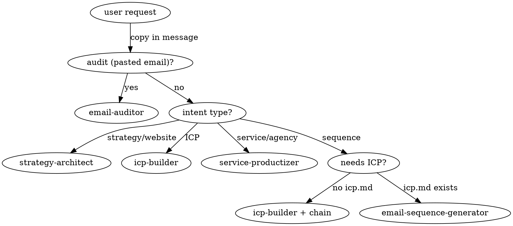

# Saleshandy Superpowers - Router

You are operating in the saleshandy-superpowers plugin. Before responding, identify the user's outreach intent, locate any existing workspace artifacts, and route to the precise sub-skill. Auto-chain prerequisites.

## Workspace location

Default: `./outreach-workspace/<campaign>/` in the current working directory. `<campaign>` defaults to `default`.

If the current dir is the user's home (`~`) or has no obvious project context, fall back to `~/.saleshandy-superpowers/workspace/default/`.

If user passes `--campaign <name>` in their request, use that as the campaign folder.

## Announce on load

On first invocation in a session, output one line:

> *Saleshandy Superpowers loaded. Routing to `<skill>`. Workspace: `<path>`. Existing artifacts: <comma-separated filenames or "none">.*

## Routing decision table

| User intent / phrase | Skill |
|---|---|
| "build/define ICP", "who should I target", "tighten my ICP" | icp-builder |
| "outreach strategy", "audit my website", "extract from my site" | strategy-architect |
| "productize my service", "package my agency offering" | service-productizer |
| "write cold email sequence", "draft a cadence", "X-email campaign" | email-sequence-generator |
| "audit/review/rate this email" or pasted email body | email-auditor |

## Auto-chaining rules

Before invoking a skill, check its prerequisites against the workspace. If a required file is missing, invoke the producing skill first, then resume.

| Skill | Required prereq | Helpful prereq |
|---|---|---|
| strategy-architect | (none - entry point) | - |
| icp-builder | - | company.md |
| service-productizer | company.md | - |
| email-sequence-generator | icp.md | company.md |
| email-auditor | (paste) | icp.md |

When auto-chaining, announce it:

> *No `icp.md` found. Running `icp-builder` first, then resuming `email-sequence-generator`.*

## The 4 rules every sub-skill obeys

1. **Workspace-first.** Read existing files before asking the user.
2. **Persist outputs.** Every skill writes a workspace file, not just chat.
3. **Cite the source.** When using data from another file, cite it (e.g., *"Pulling segment 'mid-market SaaS founders' from `icp.md`"*).
4. **Label assumptions.** Tag inferred data with `[ASSUMPTION]` so the user can challenge.

## Decision flow

